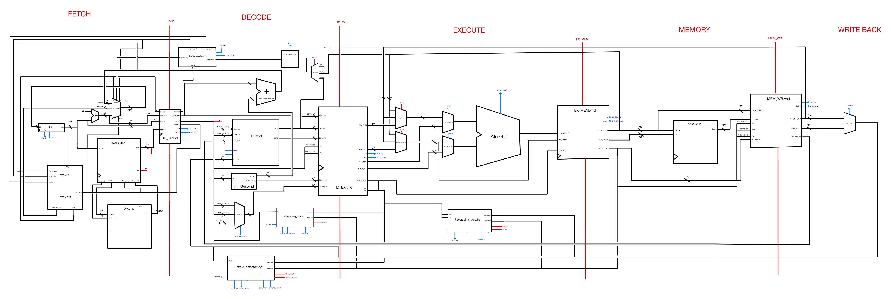
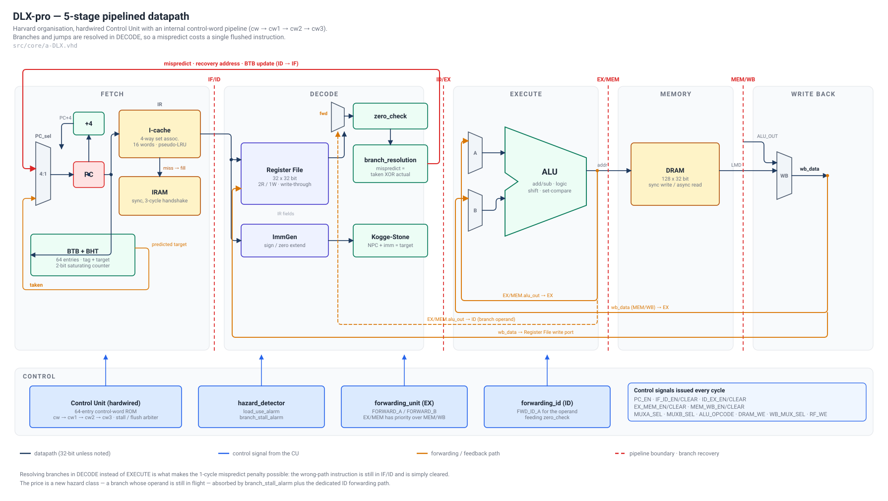
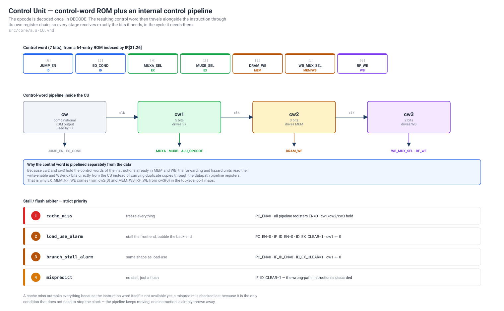
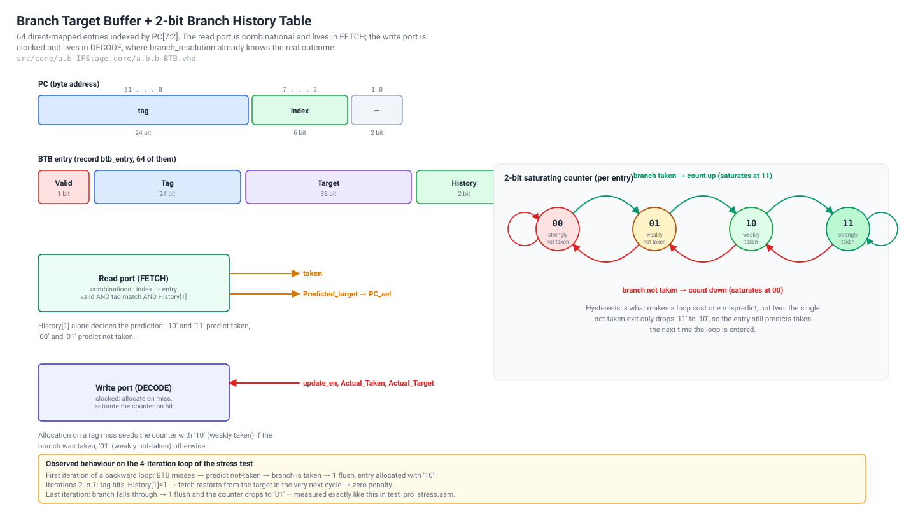
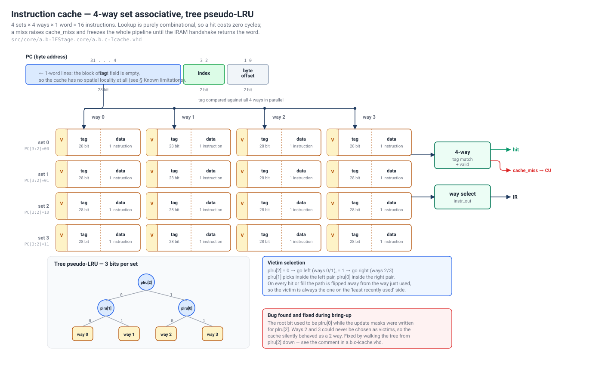
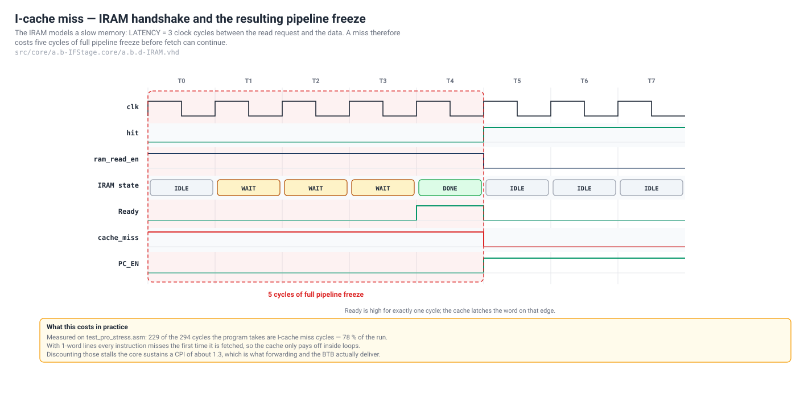
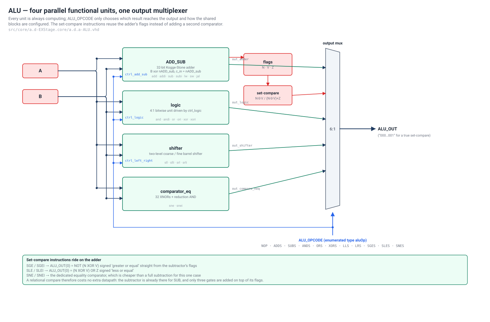
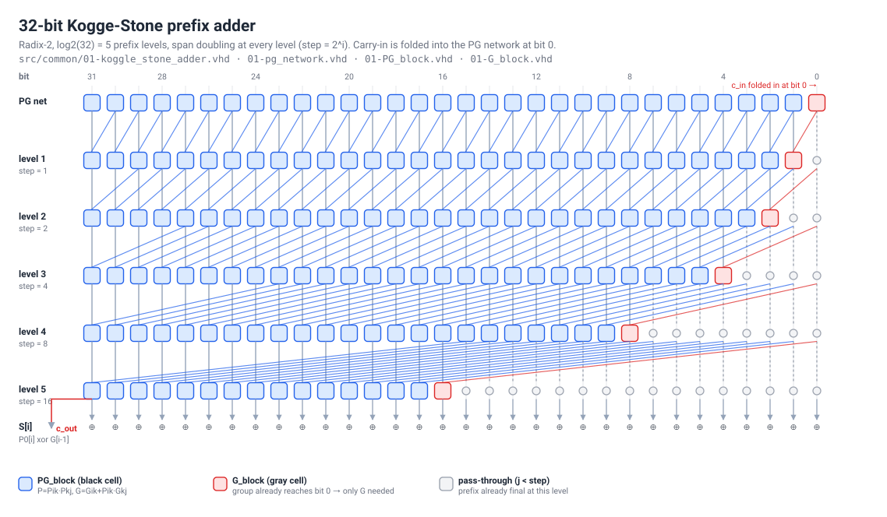
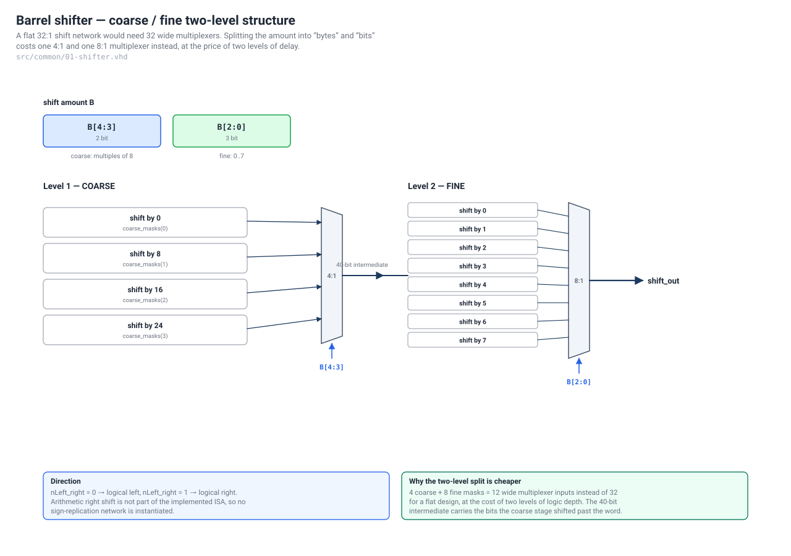
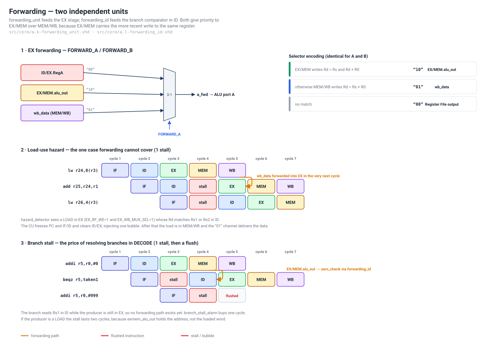

# DLX-pro

**A 5-stage pipelined DLX microprocessor in VHDL — with branch prediction, a set-associative
instruction cache, full forwarding, and branch resolution moved into DECODE.**

<p align="center">
  
</p>
<p align="center">
  <sub>The datapath as it was designed on paper before a line of VHDL was written.
  Full-resolution original: <a href="docs/datapath-hand-drawn.pdf">docs/datapath-hand-drawn.pdf</a></sub>
</p>

---

## Contents

- [What this is](#what-this-is)
- [Verification status](#verification-status)
- [Quick start](#quick-start)
- [Repository layout](#repository-layout)
- [Instruction set](#instruction-set)
- [Architecture](#architecture)
  - [1. Pipeline overview](#1-pipeline-overview)
  - [2. The Control Unit and its control-word pipeline](#2-the-control-unit-and-its-control-word-pipeline)
  - [3. FETCH — next-PC selection](#3-fetch--next-pc-selection)
  - [4. FETCH — Branch Target Buffer](#4-fetch--branch-target-buffer)
  - [5. FETCH — instruction cache and IRAM handshake](#5-fetch--instruction-cache-and-iram-handshake)
  - [6. DECODE — register file, immediates, branch resolution](#6-decode--register-file-immediates-branch-resolution)
  - [7. EXECUTE — the ALU](#7-execute--the-alu)
  - [8. EXECUTE — the Kogge-Stone adder](#8-execute--the-kogge-stone-adder)
  - [9. EXECUTE — the barrel shifter](#9-execute--the-barrel-shifter)
  - [10. Forwarding and hazards](#10-forwarding-and-hazards)
  - [11. MEMORY and WRITE BACK](#11-memory-and-write-back)
- [Measured performance](#measured-performance)
- [Known limitations and future work](#known-limitations-and-future-work)
- [Toolchain](#toolchain)
- [License](#license)

---

## What this is

A complete RTL implementation of a DLX processor, written from scratch in structural VHDL.
It is not a behavioural model: every block — down to the carry-propagate network of the adder
and the replacement policy of the cache — is described as hardware and instantiated explicitly.

| | |
| --- | --- |
| **Pipeline** | 5 stages (IF, ID, EX, MEM, WB), 4 pipeline registers |
| **Organisation** | Harvard — separate instruction and data memories |
| **Control** | Hardwired, with a dedicated control-word pipeline (`cw → cw1 → cw2 → cw3`) |
| **Branch handling** | Resolved in **DECODE**, BTB + 2-bit BHT, 1-cycle mispredict penalty |
| **Instruction cache** | 4-way set associative, tree pseudo-LRU, handshake to a 3-cycle IRAM |
| **Data hazards** | Full EX forwarding + a second, dedicated forwarding path into DECODE |
| **Adder** | 32-bit Kogge-Stone parallel prefix, shared by the ALU and the branch-target unit |
| **Shifter** | Two-level coarse/fine barrel shifter |
| **Size** | 35 VHDL files, ~3 300 lines |

The three things that make this a *pro* design rather than a textbook 5-stage pipeline:

1. **Branch resolution lives in DECODE, not EXECUTE.** A mispredict costs one flushed
   instruction instead of two. The cost of that decision — a new hazard class — is paid
   back with a dedicated forwarding path and a stall detector.
2. **The instruction fetch path is realistic.** Instructions do not appear magically in one
   cycle: there is a 4-way cache with a real replacement policy in front of a memory that
   takes three cycles to answer, and the whole pipeline correctly freezes on a miss.
3. **The control word is pipelined separately from the data.** Because the CU holds the
   control words of the instructions currently in MEM and WB, the forwarding and hazard
   units can read write-enable bits straight from the CU instead of dragging duplicates
   through the datapath registers.

---

## Verification status

Everything below was produced by actually running the design, not by inspection.

**Simulator:** GHDL 6.0.0 (mcode), `--std=93c --ieee=synopsys`.
**Reference:** an independent instruction-set simulator written from the ISA spec, not from
this RTL — so a match means the hardware and the specification agree, not that the RTL agrees
with itself.

| Check | Result |
| --- | --- |
| Analysis of all 35 VHDL files | **clean** — no errors, no warnings |
| `test_pro_stress.asm` (45 instructions, 50 executed) | **PASS** — all 32 registers and all 128 DRAM words identical to the reference model |
| Example programs in `sw/asm/` | **22 of 26 PASS** |
| The other 4 programs | use instructions **outside the implemented ISA** (`jr`, `sra`, `lhi`, byte/half-word loads); they are out of scope by design, not failures |
| Assembler round-trip | `.asm → .bin → .mem` reproduces the committed `sim/test.asm.mem` byte for byte |

The stress program exercises, in one run, every feature claimed above: back-to-back RAW chains
resolved by forwarding, a load-use stall, a branch stall, BTB training over a 4-iteration
backward loop, `j`/`jal` flushes, and a halt loop. The expected final register values printed by
`sim/sim_dlx.do` are reproduced exactly.

> **Not verified here:** logic synthesis. No area, frequency or power numbers are claimed
> anywhere in this repository, because no synthesis run backs them up.

---

## Quick start

### With GHDL (free, cross-platform)

```bash
cd sim && ./run_ghdl.sh
```

That compiles the whole hierarchy and runs the default program for 400 cycles. Useful flags:

```bash
./run_ghdl.sh -c 6000                      # longer run, for programs that need it
./run_ghdl.sh -w                           # also dump dlx.ghw for GTKWave
./run_ghdl.sh -m ../sw/asm/Branch.mem      # run a different program (assemble it first,
                                           #   see "Assembling a program" below)
```

Installing GHDL:

```bash
winget install ghdl.ghdl.ucrt64.mcode
```

### With ModelSim / QuestaSim

```tcl
cd <repo>/sim
do sim_dlx.do
```

The script compiles bottom-up, opens a pre-populated wave window (PC, IR, every pipeline
register, all forwarding and hazard signals, the whole register file and the first DRAM words)
and prints the expected results in the transcript.

### Assembling a program

```bash
sw/tools/assemble.sh sw/asm/test_pro_stress.asm
cp sw/asm/test_pro_stress.mem sim/test.asm.mem
```

`sim/run_ghdl.sh -m <file.mem>` does the copy for you.

---

## Repository layout

```
src/
  000-globals.vhd              aluOp enumeration shared by the CU and the ALU
  common/                      reusable primitives (01-*)
    01-koggle_stone_adder.vhd  32-bit parallel-prefix adder
    01-pg_network.vhd          generate/propagate pre-processing
    01-PG_block.vhd            "black cell"
    01-G_block.vhd             "gray cell"
    01-ADD_SUB.vhd             adder/subtractor wrapper + N/V/Z flags
    01-shifter.vhd             two-level barrel shifter
    01-logic.vhd               bitwise unit
    01-comparator_eq.vhd       equality comparator
    01-zero_check.vhd          BEQZ/BNEZ condition
    01-reg_en.vhd              register with enable
  core/
    a-DLX.vhd                  top level: instantiation and wiring only
    a.a-CU.vhd                 hardwired Control Unit
    a.b-IFStage.vhd            + a.b-IFStage.core/  PC_sel, BTB, Icache, IRAM
    a.c-IDStage.vhd            + a.c-IDStage.core/  RF, ImmGen, branch_resolution
    a.d-EXStage.vhd            + a.d-EXStage.core/  ALU
    a.e-MEMStage.vhd           + a.e-MEMStage.core/ DRAM
    a.f-WBStage.vhd
    a.g..a.j-*_reg.vhd         the four pipeline registers
    a.k-forwarding_unit.vhd    forwarding into EXECUTE
    a.l-forwarding_id.vhd      forwarding into DECODE (branch operand)
    a.m-hazard_detector.vhd    load-use and branch-stall alarms
sim/
  run_ghdl.sh                  GHDL build + run
  sim_dlx.do                   ModelSim build + run + wave setup
  tb/TB_DLX.vhd                clock, reset, SIM_CYCLES generic
  test.asm.mem                 memory image the IRAM loads at reset
sw/
  asm/                         27 example programs, test_pro_stress.asm is the flagship
  tools/                       Perl assembler + .mem converter
docs/
  img/                         every figure in this README
  notes/pc-recovery.md         bring-up note on the mispredict recovery fix
  datapath-hand-drawn.pdf      the original design drawing
```

The `a.b`, `a.c`, … prefixes are not decoration: they encode the compilation order, so the
file listing *is* the dependency graph. `01-*` files are leaf primitives with no dependency on
the core.

---

## Instruction set

The Control Unit decodes exactly this subset. Everything else maps to an all-zero control
word, which behaves as a NOP — a safe default rather than undefined behaviour.

**R-type** (opcode `0x00`, selected by `func`)

| func | instruction | | func | instruction |
| --- | --- | --- | --- | --- |
| `0x20` | `add` | | `0x26` | `xor` |
| `0x22` | `sub` | | `0x04` | `sll` |
| `0x24` | `and` | | `0x06` | `srl` |
| `0x25` | `or`  | | `0x29` | `sne` |
| `0x2C` | `sle` | | `0x2D` | `sge` |

**I-type**

| opcode | instruction | | opcode | instruction |
| --- | --- | --- | --- | --- |
| `0x08` | `addi` | | `0x16` | `srli` |
| `0x0A` | `subi` | | `0x19` | `snei` |
| `0x0C` | `andi` *(zero-extended)* | | `0x1C` | `slei` |
| `0x0D` | `ori` *(zero-extended)*  | | `0x1D` | `sgei` |
| `0x0E` | `xori` *(zero-extended)* | | `0x15` | `nop` |
| `0x14` | `slli` | | | |

**Memory and control flow**

| opcode | instruction | notes |
| --- | --- | --- |
| `0x23` | `lw` | effective address computed by the ALU |
| `0x2B` | `sw` | |
| `0x02` | `j` | 26-bit sign-extended offset, target computed in DECODE |
| `0x03` | `jal` | writes `PC+4` into `R31` |
| `0x04` | `beqz` | resolved in DECODE |
| `0x05` | `bnez` | resolved in DECODE |

`R0` is hardwired to zero on both read ports and ignored by the write port.
There are **no delay slots**: control-flow changes are absorbed by flushing, not by exposing
the hazard to the programmer.

---

## Architecture

### 1. Pipeline overview



Five stages, four pipeline registers, and three feedback paths that define the whole design:

- **ID → IF**, carrying `mispredict`, the recovery address and the BTB update. This is what
  makes prediction possible.
- **EX/MEM → EX** and **MEM/WB → EX**, the classic forwarding paths.
- **EX/MEM → ID**, a fourth path that exists only because branches are resolved early.

Every pipeline register has both an `enable` (for stalls) and a synchronous `clear`
(for flushes), driven by the Control Unit. A cleared register injects an all-zero word, which
decodes as a NOP — the bubble is a real, physical thing in this design, not a modelling trick.

### 2. The Control Unit and its control-word pipeline



The opcode is decoded **once**, in DECODE, by indexing a 64-entry ROM of 7-bit control words
(opcodes `0x00`–`0x2F` are listed explicitly; everything above falls through to an all-zero
word via `others`):

```
[6] JUMP_EN | [5] EQ_COND | [4] MUXA_SEL | [3] MUXB_SEL | [2] DRAM_WE | [1] WB_MUX_SEL | [0] RF_WE
```

The control word then walks through its own register chain in step with the instruction:
`cw` (ID) → `cw1` (EX) → `cw2` (MEM) → `cw3` (WB). Each register is trimmed to just the bits
still needed downstream: 7 bits, then 5, then 3, then 2.

**Why this matters beyond tidiness.** Because `cw2` and `cw3` are, by construction, the control
words of the instructions currently in MEM and WB, the forwarding and hazard units can read
`EX_MEM_RF_WE` from `cw2(0)` and `MEM_WB_RF_WE` from `cw3(0)` directly. No duplicate copies of
the write-enable bits are threaded through the datapath pipeline registers. The same trick gives
`hazard_detector` the `WB_MUX_SEL` bit it needs to tell a load apart from an ALU instruction.

The second half of the CU is a **strict-priority stall/flush arbiter**:

| priority | alarm | response |
| --- | --- | --- |
| 1 | `cache_miss` | freeze everything: `PC_EN=0`, all pipeline registers disabled, `cw1/cw2/cw3` hold |
| 2 | `load_use_alarm` | `PC_EN=0`, `IF_ID_EN=0`, `ID_EX_CLEAR=1`, `cw1 ← 0` |
| 3 | `branch_stall_alarm` | same shape as load-use |
| 4 | `mispredict` | `IF_ID_CLEAR=1` — no stall, one instruction discarded |

The ordering is not arbitrary. A cache miss outranks everything because the instruction word
itself does not exist yet. A mispredict is checked last precisely because it is the only
condition that does **not** need to stop the clock: the pipeline keeps advancing and one
wrong-path instruction is thrown away.

A pleasant consequence of this priority: if a branch mispredicts *during* a cache-miss freeze,
`mispredict` stays asserted (IF/ID is frozen, so the branch stays in DECODE) and the recovery
happens correctly on the cycle the miss resolves. The two mechanisms compose without any
special case.

### 3. FETCH — next-PC selection


Every possible redirection of the instruction stream converges on one 4-input priority mux.
Three inputs are obvious; the fourth is the interesting one.

| priority | condition | next PC |
| --- | --- | --- |
| 1 | `mispredict` and `actual_taken` | branch target (`NPC + imm`) |
| 2 | `mispredict` and **not** `actual_taken` | **`branch_npc`** — the branch's own `PC+4` |
| 3 | `taken` (BTB predicts taken) | predicted target |
| 4 | — | `PC + 4` |

Input 2 was added after a bug found during bring-up. A misprediction has two directions, and
only one of them recovers to the branch target. When the BTB has been trained to *taken* and
the branch finally falls through — exactly what happens on the last iteration of every loop —
the correct restart address is the instruction after the branch. With a single recovery input
the PC was reloaded with the loop target and the loop never terminated.

The wire that trains the BTB still carries the target in both directions, so adding the
fall-through path to the mux does not corrupt the predictor.
Full write-up: [`docs/notes/pc-recovery.md`](docs/notes/pc-recovery.md).

### 4. FETCH — Branch Target Buffer



64 direct-mapped entries indexed by `PC[7:2]`, each holding `valid | tag(24) | target(32) | history(2)`.

The two ports live in different stages, and that split is the whole point:

- **Read port, in FETCH, purely combinational.** The PC being fetched indexes the table; if the
  entry is valid, the tag matches and `history[1]` is set, `taken` and `predicted_target` go
  straight into the PC mux in the *same* cycle. A correctly predicted taken branch therefore
  costs nothing at all.
- **Write port, in DECODE, clocked.** By the time the instruction reaches DECODE,
  `branch_resolution` already knows the true outcome, so the update is exact — there is no
  speculative training.

The 2-bit saturating counter provides the hysteresis that makes a loop cost *one* mispredict
rather than two: exiting the loop only drops `11` to `10`, so the entry still predicts taken
the next time the loop is entered. On a tag miss the entry is allocated at `10` (weakly taken)
if the branch was taken and `01` otherwise.

Measured on the 4-iteration loop in the stress test: one mispredict on entry, three
zero-penalty iterations, one mispredict on exit. Exactly the textbook behaviour.

### 5. FETCH — instruction cache and IRAM handshake



4 sets × 4 ways × 1 word, indexed by `PC[3:2]`, tagged with `PC[31:4]`. Lookup is combinational,
so a hit costs zero cycles; a miss raises `cache_miss` and the CU freezes the entire pipeline.

**Replacement is tree pseudo-LRU**, 3 bits per set. `plru[2]` chooses the left pair (ways 0/1)
or the right pair (ways 2/3); `plru[1]` and `plru[0]` choose inside each pair. On every hit or
fill the path is flipped *away* from the way just used, so the victim is always on the least
recently used side. Three bits instead of the 5 bits (⌈log₂ 4!⌉) that true LRU would need,
and a two-gate update instead of a shift network.

> **A bug worth recording.** The victim walk originally started from `plru[0]` while the update
> masks were written for `plru[2]`. The tree still worked — it just never selected ways 2 or 3,
> which stayed `valid = '0'` forever. The cache silently behaved as a 2-way with half its
> capacity, and every test still passed. It was only visible by watching the `valid` bits.



Behind the cache, the IRAM deliberately models a slow memory: a small FSM (`IDLE → WAITING →
DONE`) answers a read request after `LATENCY = 3` clock cycles and raises `Ready` for exactly
one cycle. The cache latches the word on that edge, the tag becomes valid, `hit` goes high, and
the pipeline restarts. **Five cycles of full freeze per miss.**

This is the honest part of the design, and it dominates the cycle count — see
[Measured performance](#measured-performance).

### 6. DECODE — register file, immediates, branch resolution

**Register file.** 32 × 32 bit, two asynchronous read ports and one synchronous write port,
with **write-through bypass**: if the register being written in WB is the one being read in ID,
the read port returns the incoming data directly. Without this the pipeline would need a fourth
forwarding path just to cover the ID/WB overlap.

**Immediate generator.** Sign-extends the 16-bit field for arithmetic, zero-extends it for
`andi`/`ori`/`xori`, sign-extends the 26-bit field for `j`/`jal`, and — the one piece of
trickery in the design — forces the immediate to **zero for `jal`**. That lets `jal` reuse the
ALU with `MUXA = NPC` to compute `NPC + 0 = PC + 4`, which is exactly the link value written
into `R31`. No dedicated link adder.

**Branch resolution.** Three tiny blocks:

```vhdl
branch_true      <= eq_cond and zero_checker_in;
actual_taken_sig <= branch_true or jump_en_in;
mispredict_out   <= taken_in xor actual_taken_sig;
```

`taken_in` is the prediction the BTB made for *this* instruction, carried down through the IF/ID
register. A mispredict is therefore a single XOR. `zero_check` distinguishes `beqz` from `bnez`
using `opcode(0)` alone — `0x04` vs `0x05` differ only in that bit, so no extra decode is needed.

The branch target is computed by a **second instance of the Kogge-Stone adder** (`NPC + imm`),
in parallel with the register read, so the target is ready in the same cycle the condition is.

**Why resolve here at all?** Because the alternative — resolving in EXECUTE — costs two flushed
instructions per mispredict instead of one. With branch prediction on top, mispredicts should be
rare, but when they do happen the penalty is halved. The price is a new hazard class, which is
what the next two blocks exist to handle.

### 7. EXECUTE — the ALU



Four functional units run **in parallel, unconditionally**, and a single output multiplexer
picks the result. `ALU_OPCODE` — an enumerated VHDL type, not a magic bit pattern — both selects
the output and configures the shared blocks (`ctrl_add_sub`, `ctrl_logic`, `ctrl_left_right`).

Letting everything compute and selecting at the end is the right trade for a single-cycle ALU:
gating the inputs would add a mux delay in front of every unit on the critical path in order to
save power that a design of this size does not care about.

The detail worth pointing out is the **set-compare family**. `sge`, `sle`, `sgei`, `slei` do not
get their own comparator. They configure the adder to subtract and then read its flags:

| instruction | result bit 0 |
| --- | --- |
| `sge`, `sgei` | `NOT (N XOR V)` |
| `sle`, `slei` | `(N XOR V) OR Z` |
| `sne`, `snei` | dedicated equality comparator |

`N XOR V` is the standard signed less-than test — correct across overflow, which a naive sign-bit
test is not. A relational compare therefore costs three gates on top of hardware that already
exists for `sub`. Only `sne` gets its own block, because a 32-wide XNOR tree plus a reduction AND
is cheaper than a full subtraction when all you need is equality.

### 8. EXECUTE — the Kogge-Stone adder



The single most structural piece of the design. A ripple-carry adder is O(n) deep; this is a
radix-2 parallel-prefix adder, **log₂(32) = 5 levels deep**, generated entirely by VHDL
`for … generate` loops so the 32-bit instance and a hypothetical 64-bit one come from the same
source.

The three cell types in the figure map one-to-one onto three VHDL entities:

| cell | entity | function |
| --- | --- | --- |
| blue square | `PG_block` | `P = Pik·Pkj`, `G = Gik + Pik·Gkj` |
| red square | `G_block` | `G = Gik + Pik·Gkj` only |
| grey circle | — | pass-through: the prefix is already final at this level |

**Two implementation details that are easy to get wrong:**

*Carry-in is folded into the PG network*, not bolted on afterwards:

```vhdl
G(0) <= (A(0) and B(0)) or ((A(0) xor B(0)) and cin);
```

This makes bit 0's generate signal already account for `c_in`, which is what lets the prefix tree
be a pure prefix computation with no special carry-in path.

*Gray cells are placed exactly where the group already reaches bit 0.* When `j - step = 0`, the
group spans down to the LSB, so its propagate signal can never be needed again — only `G` is
computed, and `P` is forced to `'0'`. That is the red diagonal in the figure. Getting this
condition wrong produces an adder that is correct for most operands and wrong for a few, which is
the worst kind of bug to find in simulation.

The same entity is instantiated **twice**: once inside `ADD_SUB` in the ALU, and once in DECODE
for the branch-target computation.

### 9. EXECUTE — the barrel shifter



A flat 32:1 shifter needs 32 wide multiplexer inputs. This one splits the 5-bit amount in two:

- **Coarse level** — `B[4:3]` selects one of 4 masks, shifting by 0, 8, 16 or 24 bits.
- **Fine level** — `B[2:0]` selects one of 8 masks, shifting by 0…7.

12 wide multiplexer inputs instead of 32, at the cost of two levels of logic depth. The
intermediate signal is **40 bits wide**, not 32, so the coarse stage can keep the bits it pushed
past the word boundary until the fine stage has had its turn.

`nLeft_right` picks the direction. Arithmetic right shift is not in the implemented ISA, so no
sign-replication network is built — an honest omission rather than dead silicon.

### 10. Forwarding and hazards



**Two separate forwarding units**, because there are two places that need operands early.

`forwarding_unit` feeds EXECUTE. It compares `ID/EX.Rs1`/`Rs2` against the destinations of the
instructions in MEM and WB, and drives a 3:1 mux in front of each ALU port:

| selector | source | condition |
| --- | --- | --- |
| `"10"` | `EX/MEM.alu_out` | MEM writes `Rd = Rs`, `Rd ≠ R0` |
| `"01"` | `wb_data` | otherwise WB writes `Rd = Rs`, `Rd ≠ R0` |
| `"00"` | register file | no match |

EX/MEM wins over MEM/WB because it carries the more recent write to the same register. The
`Rd ≠ R0` guard matters: without it, any instruction with `Rd = R0` would forward its result over
the hardwired zero.

`forwarding_id` feeds the branch comparator in DECODE with one extra rule: **it refuses to forward
from EX/MEM when the instruction there is a load**, because at that point `exmem_alu_out` holds
the memory *address*, not the loaded word. That case is handed to the stall detector instead.

**Load-use hazard** — the one case forwarding genuinely cannot cover, because the data is still
inside the memory. `hazard_detector` spots a load in EX (`EX_RF_WE = 1` and `EX_WB_MUX_SEL = 1`)
whose `Rd` matches `Rs1` or `Rs2` in ID, and raises `load_use_alarm`. The CU freezes PC and IF/ID
and clears ID/EX. One cycle later the load is in MEM/WB and the `"01"` channel delivers the value
before it is ever written to the register file. **Cost: 1 cycle.**

**Branch stall** — the price of resolving branches early. A branch reads `Rs1` in DECODE while its
producer may still be in EXECUTE, where no forwarding path exists yet. `branch_stall_alarm` buys
one cycle, after which the producer is in MEM and `forwarding_id` can supply the value. If the
producer is a *load*, the stall lasts two cycles, for the reason above.

Note that `branch_stall_alarm` is qualified by `EQ_COND`, so it never fires for `j` or `jal` —
unconditional jumps read no registers and must not be penalised.

### 11. MEMORY and WRITE BACK

**DRAM**: 128 × 32 bit, synchronous write, asynchronous read, guarded by `is_X` so an undefined
address during reset produces zeros instead of propagating `X` through the pipeline.

**Write back** is a single 2:1 mux on `WB_MUX_SEL`: ALU result, or the word loaded from memory.
Its output goes to three places — the register file write port, the EX forwarding mux, and the ID
forwarding mux — which is why `wb_data` rather than `memwb_lmd` is the signal that gets forwarded:
it is already post-mux, so a load and an ALU instruction are forwarded through the same wire.

---

## Measured performance

From a GHDL run of `sw/asm/test_pro_stress.asm`, counted on the real waveform:

| Metric | Value |
| --- | --- |
| Instructions executed | 50 |
| Total cycles (reset release → halt) | **294** |
| Cycles stalled on I-cache misses | **229** (78 % of the run) |
| Load-use stall events | 2 |
| Branch stall events | 5 |
| Pipeline flushes (`IF_ID_CLEAR`) | 7 |
| Raw CPI | 5.88 |
| **CPI excluding cache-miss stalls** | **≈ 1.30** |

The two numbers tell the whole story.

**1.30 is what the pipeline actually delivers.** With operands available, forwarding absorbs every
RAW dependency in the back-to-back chains at zero cost, and the BTB turns three of the four loop
iterations into zero-penalty taken branches. The residual 0.30 is the 2 load-use stalls, the 5
branch stalls and the 7 flushes, spread over 50 instructions.

**5.88 is what the memory system costs.** With 1-word cache lines there is no spatial locality
whatsoever: all 45 instruction words — plus the handful of wrong-path fetches — miss the first
time they are fetched, at ~5 cycles each. The cache only pays for itself inside the loop, where iterations 2-4
hit. This is not a bug — it is the direct, measurable consequence of the line size, and it is the
single highest-value thing to fix.

---

## Known limitations and future work

Listed honestly, in rough order of how much they would matter.

1. **The I-cache has 1-word lines.** 78 % of the stress test's cycles are miss stalls. Moving to
   4-word lines with a burst fill would amortise the IRAM latency over four instructions and
   should cut total cycles by roughly half on straight-line code. This is the biggest win
   available and it requires no change to the pipeline.

2. **The DRAM decodes only `Addr(6 downto 2)`.** That is 5 bits — 32 words — while `RAM_DEPTH` is
   128 and the comment in the file claims 128 words are handled. Words 32…127 are unreachable and
   addresses alias every 128 bytes. The fix is a one-line change to `Addr(8 downto 2)`; it is
   flagged rather than applied here because it changes observable behaviour of existing programs
   (`sw/asm/Branch.asm` writes past word 31 and currently relies on the wraparound).

3. **BTB updates are not gated during stalls.** `update_en` is asserted for every cycle the branch
   sits in DECODE, so a branch held there by a stall or a cache-miss freeze trains its 2-bit
   counter more than once for a single resolution. Worse, in the first cycle of a branch stall the
   operand has not been forwarded yet, so that extra training can use the wrong outcome. It has
   not produced a wrong prediction in any test — the counter saturates or cancels out — but it is
   a correctness smell. The fix is to qualify `update_en_out` with "not stalled".

4. **No `jr` / `jalr`.** `jal` can call a subroutine but cannot return through `R31`; the example
   programs return with an explicit jump. Adding `jr` means routing a register value into the PC
   mux, which the 4-input priority mux already has the shape for.

5. **Missing ISA corners:** arithmetic right shift (`sra`), byte and half-word memory access,
   `slt`/`sgt`/`seq`, `lhi`. Four of the example programs in `sw/asm/` use these and are therefore
   out of scope for this core.

6. **No exceptions, interrupts or alignment checks.** Unaligned accesses silently use the
   truncated address.

7. **No synthesis flow.** The design is written to be synthesisable — no `wait for`, no
   initialised signals in the datapath, a clean reset — but no timing or area numbers are claimed
   because no synthesis run backs them up.

8. **The testbench checks nothing automatically.** It drives clock and reset and stops; correctness
   was established by comparing the final architectural state against a reference model outside the
   simulator. A self-checking testbench that asserts the expected register values at the end would
   turn that into a one-command regression.

---

## Toolchain

The assembler is Ethan L. Miller's `dlxasm.pl` (1999), a two-pass DLX assembler in Perl, shipped in
`sw/tools/` together with a wrapper:

```bash
sw/tools/assemble.sh sw/asm/foo.asm
#   foo.bin    raw big-endian machine code
#   foo.list   annotated listing
#   foo.mem    one 8-digit hex word per line, what the IRAM reads
```

The wrapper uses `od` rather than `hexdump` to produce the `.mem` file, because `od` ships with
Git Bash and MSYS2 on Windows while `hexdump` generally does not.

---

## License

MIT — see [LICENSE](LICENSE).

The assembler in `sw/tools/dlxasm.pl` is © 1999 Ethan L. Miller and carries its own terms.
