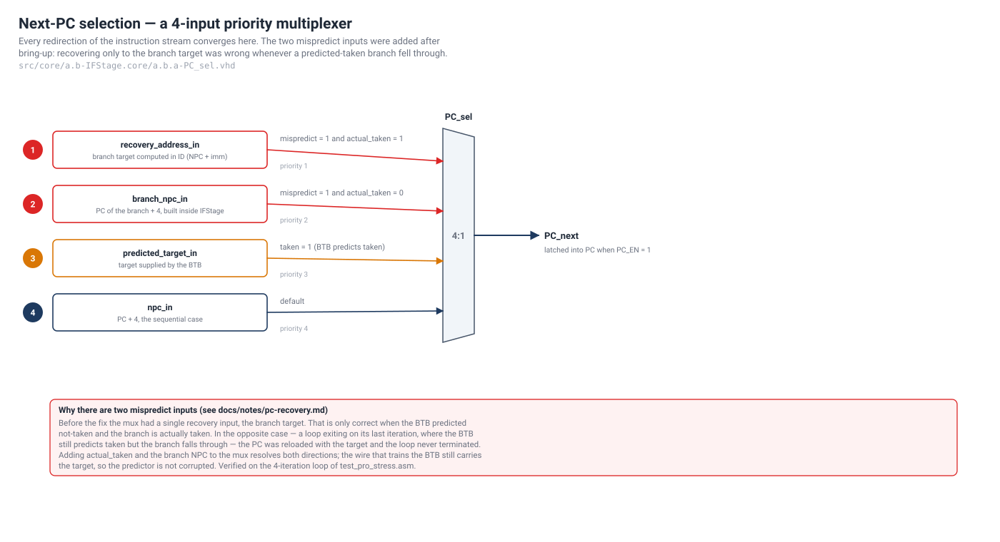

# Bring-up note — recovering the PC after a misprediction

> English version of [`pc-recovery.it.md`](pc-recovery.it.md), the note written while
> debugging the branch-prediction path. Kept in the repository because the fix
> explains why `pc_mux` has four inputs instead of the obvious three.



## Symptom

A backward loop never terminated. The counter reached zero, the branch was
correctly evaluated as *not taken* in DECODE, `mispredict` went high as
expected, and IF/ID was flushed — and then the PC jumped straight back to the
top of the loop instead of falling through.

## Diagnosis

The misprediction itself was detected correctly:

```vhdl
mispredict_out <= taken_in xor actual_taken_sig;
```

The problem was the *recovery address*. DECODE produced exactly one address for
the fetch stage to restart from:

```
recovery_address = NPC + IMM        -- the branch target
```

That address is only correct in one of the two mispredict directions:

| BTB predicted | branch actually | correct restart address |
| --- | --- | --- |
| not taken | **taken** | branch target — `NPC + IMM` |
| **taken** | not taken | the instruction after the branch — `NPC` |

The second row is precisely the last iteration of a trained loop: the BTB has
saturated at `11`, so it keeps predicting *taken*, and the one address the mux
could choose was the loop target. The loop restarted forever.

## Fix

Two inputs were added to `pc_mux`: `actual_taken_in`, and the branch's own NPC,
derived inside `IFStage` as

```vhdl
branch_npc <= std_logic_vector(unsigned(pc_update_in) + 4);
```

`pc_update_in` is the PC of the branch currently sitting in DECODE, so
`pc_update_in + 4` is the fall-through address. The selector became a four-input
priority mux:

| priority | condition | next PC |
| --- | --- | --- |
| 1 | `mispredict = 1` and `actual_taken = 1` | `recovery_address_in` (target) |
| 2 | `mispredict = 1` and `actual_taken = 0` | `branch_npc_in` (fall-through) |
| 3 | `taken = 1` (BTB predicts taken) | `predicted_target_in` |
| 4 | — | `npc_in` (`PC + 4`) |

The wire that feeds the BTB (`Actual_Target`) was left untouched and still
carries the branch target in both directions, so the predictor is never trained
with a fall-through address. The change is confined to `a.b.a-PC_sel.vhd` and to
its port map inside `a.b-IFStage.vhd`.

## Verification

The 4-iteration backward loop in [`sw/asm/test_pro_stress.asm`](../../sw/asm/test_pro_stress.asm)
now produces exactly the expected fetch sequence — one mispredict on entry, three
zero-penalty predicted-taken iterations, one mispredict on exit:

```
... 8C 90 94 98 | 8C 90 94 | 8C 90 94 | 8C 90 94 | 8C 98 ...
        ^  ^                                          ^
        |  +-- wrong-path fetch, flushed              +-- fall-through, correct
        +----- bnez at 0x94, target 0x8C
```

and the loop terminates with `r28 = 0`, `r29 = 4`.
